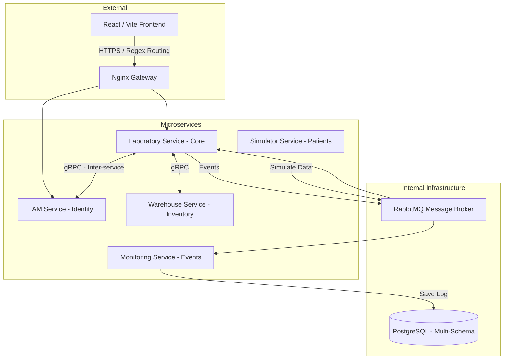

# OJT Laboratory — Detailed Architecture

## Hệ thống Microservices & Giao tiếp
Dự án được xây dựng dựa trên mô hình Microservices, tập trung vào khả năng mở rộng và xử lý bất đồng bộ.

### Mermaid Diagram: System Orchestration


---

## 🛠️ Key Technical Implementations

### 1. gRPC Inter-service Communication
Sử dụng gRPC cho các truy vấn đồng bộ giữa các service nội bộ (ví dụ: LAB hỏi IAM về thông tin User).
- **Pattern**: `ServiceBase` inheritance + `AutoMapper` DTO conversion.
- **Config**: Kích hoạt `Http2UnencryptedSupport` để chạy gRPC không TLS trong mạng nội bộ Docker.

### 2. Event-driven Monitoring (RabbitMQ)
Toàn bộ log và sự kiện được tách biệt khỏi luồng xử lý chính.
- **Flow**: Action tại Lab -> Publish Event to RabbitMQ -> Monitoring Service tiêu thụ bất đồng bộ.
- **Reliability**: Sử dụng `BasicAck` (manual acknowledgment) trong `BackgroundService` để đảm bảo không mất dữ liệu nếu DB gặp sự cố.

### 3. Multi-Schema EF Core Strategy
Chia sẻ chung một instance PostgreSQL nhưng lưu trữ dữ liệu trong các Schema riêng biệt (`laboratory_service`, `iam_service`).
- **Implementation**:
  ```csharp
  // Tại OnModelCreating
  var schemaName = SchemaName ?? "laboratory_service";
  modelBuilder.HasDefaultSchema(schemaName);
  ```
- **Benefit**: Dễ quản lý Backup/Restore chung mà vẫn đảm bảo tính cô lập dữ liệu (Isolation).

### 4. Automated Developer Workflow
Hệ thống script `.bat` tại thư mục `Scripts/` cho phép:
- Clean rác project.
- Chạy Unit Test + Xuất báo cáo Coverage HTML tự động.
- Tự động hóa Migration Database.

---

## 📂 Gold Standard Structure
```text
Laboratory_Service/
├── Laboratory_Service.API/          # Entry point, gRPC Services, Hubs
├── Laboratory_Service.Application/  # MediatR Handlers, DTOs, Business Logic
├── Laboratory_Service.Domain/       # Entities, Value Objects
├── Laboratory_Service.Infrastructure/ # EF Core, RabbitMQ, gRPC Clients
├── Laboratory_Service.sln
└── Scripts/                         # Automation Scripts
```
