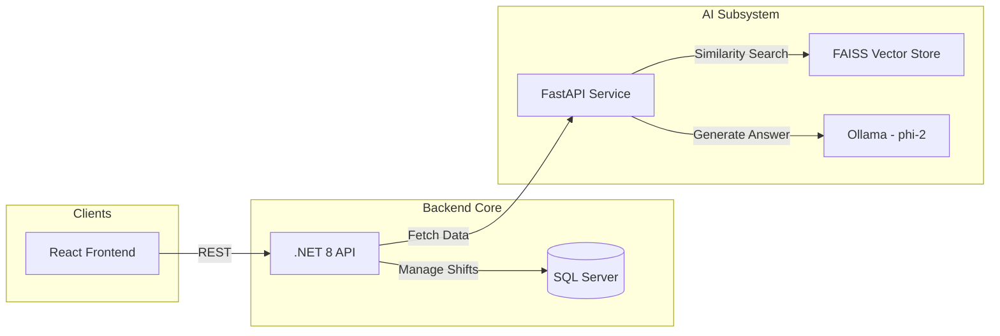

# SWP BloodLine — Detailed Architecture

## Hệ thống Quản lý Dữ liệu Di truyền & AI
Dự án tập trung vào tính công bằng trong vận hành và sức mạnh từ AI RAG địa phương.

### Mermaid Diagram: Business Flow


---

## 🛠️ Key Technical Implementations

### 1. Greedy Fairness Scheduling Algorithm
Thuật toán phân ca tự động dựa trên nguyên tắc công bằng tuyệt đối về workload.
- **Constraint check**: 
  - Không trùng ca cùng ngày.
  - Không làm ca Sáng ngay sau ca Chiều ngày hôm trước (Morning after Afternoon).
- **Fairness Logic**: 
  - Đếm tổng số ca thực tế + số ca đã gợi ý hiện tại.
  - Sắp xếp nhân viên theo `TotalCount` tăng dần.
  - Áp dụng `Round-Robin` nếu count bằng nhau.

### 2. Local RAG (Retrieval Augmented Generation)
Hệ thống chatbot hỏi đáp về kiến thức DNA không phụ thuộc vào Internet.
- **Stack**: LangChain + FAISS + GPT4All Embeddings.
- **Model**: `phi-2` qua Ollama.
- **Prompting**: Structured context passing (Document info -> Question -> Answer).

### 3. Repository & Data Stewardship
Dự án sử dụng Repository Pattern tiêu chuẩn để quản lý dữ liệu DNA nhạy cảm.
- Một Repository tập trung cho các Entity chính.
- Sử dụng Custom Repository (`ShiftAssignmentRepositoryCustom`) cho các truy vấn báo cáo phức tạp (WorkShiftsByUserAndMonth).

---

## 📂 Gold Standard Structure
```text
BloodLine_DNA/
├── DNA_Blood_API/           # Main .NET Core Backend
│   ├── Controllers/
│   ├── Repository/          # Data Access Layer
│   ├── Services/            # Business Logic (Fairness Alg)
│   └── ViewModels/          # Data Transfer Objects
├── ai_service/              # Python FastAPI + LangChain
└── DNA_Blood_Front_End/     # Vite + React Frontend
```
